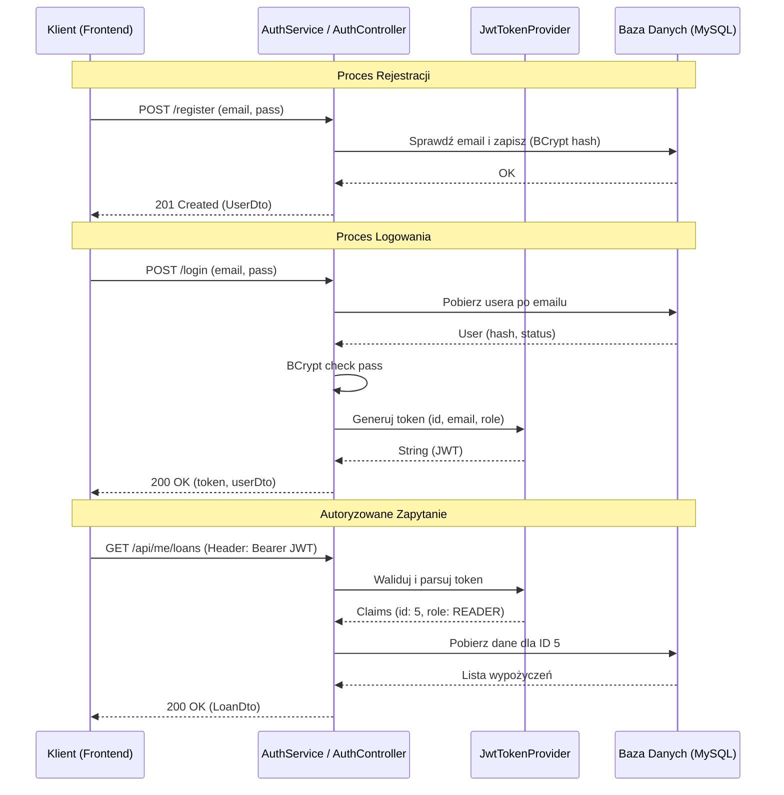

# Proces Autentykacji i Autoryzacji

Dokument opisuje mechanizmy bezpieczeństwa zaimplementowane w systemie, w tym rejestrację użytkowników, proces logowania oraz generowanie i weryfikację tokenów JWT.

---

## 1. Rejestracja Użytkownika

Proces rejestracji pozwala nowym osobom na założenie konta w systemie z domyślną rolą `READER` (Czytelnik).

### Przepływ (Flow):
1. **Żądanie:** Klient wysyła dane (`email`, `password`, `firstName`, `lastName`) na endpoint `POST /api/auth/register`.
2. **Walidacja:** System sprawdza, czy podany adres email jest już zajęty w bazie danych.
3. **Bezpieczeństwo Hasła:** Hasło w postaci jawnej **nigdy nie jest zapisywane**. System używa algorytmu `BCrypt` (klasa `PasswordEncoder`) do wygenerowania bezpiecznego hasha.
4. **Tworzenie Encji:** Tworzona jest nowa encja `AppUser` ze statusem `ACTIVE` i aktualną datą utworzenia.
5. **Odpowiedź:** System zwraca dane użytkownika (bez hasła) w formacie `UserDto` z kodem `201 Created`.

---

## 2. Logowanie i Generowanie JWT

Logowanie jest jedynym procesem, w którym użytkownik przesyła swoje hasło. Wynikiem poprawnego logowania jest token JWT (JSON Web Token).

### Przepływ (Flow):
1. **Żądanie:** Klient wysyła `email` i `password` na endpoint `POST /api/auth/login`.
2. **Weryfikacja Poświadczeń:**
    - Pobranie użytkownika z bazy po adresie email.
    - Porównanie przesłanego hasła z hashem zapisanym w bazie (`passwordEncoder.matches`).
    - Sprawdzenie, czy konto nie jest zablokowane (`status == 'BLOCKED'`).
3. **Generowanie Tokena:**
    - Jeśli dane są poprawne, `JwtTokenProvider` tworzy token JWT.
    - **Algorytm:** HMAC SHA256 (`HS256`).
    - **Claimy (Zawartość):**
        - `sub` (Subject): ID użytkownika.
        - `email`: Adres email.
        - `role`: Rola użytkownika (`READER` lub `ADMIN`).
        - `iat` (Issued At): Czas wystawienia.
        - `exp` (Expiration): Czas wygaśnięcia (domyślnie 24h).
4. **Odpowiedź:** Klient otrzymuje obiekt `AuthResponse` zawierający token oraz uproszczone dane użytkownika.

---

## 3. Autoryzacja Żądań (JWT Flow)

Po zalogowaniu, klient musi dołączać token do każdego chronionego zapytania.

### Przekazywanie Tokena:
Klient umieszcza token w nagłówku HTTP:
```http
Authorization: Bearer <twój_token_jwt>
```

### Proces weryfikacji na Backendzie (`JwtAuthenticationFilter`):
1. **Przechwycenie:** Filtr wyciąga ciąg znaków po słowie `Bearer ` z nagłówka `Authorization`.
2. **Walidacja:**
    - Sprawdzenie podpisu cyfrowego tokena przy użyciu klucza tajnego (`jwtSecret`).
    - Sprawdzenie, czy token nie wygasł.
3. **Ekstrakcja Danych:** Pobranie `userId` oraz `role` z wnętrza tokena.
4. **Kontekst Bezpieczeństwa:** 
    - System mapuje rolę z bazy na format Spring Security (dodanie prefixu `ROLE_`, np. `ROLE_ADMIN`).
    - Ustawienie obiektu `Authentication` w `SecurityContextHolder`.
    - Od tego momentu kontrolery mogą korzystać z adnotacji `@PreAuthorize("hasRole('ADMIN')")` lub pobierać ID użytkownika przez `@CurrentUser`.

---

## 4. Parametry Techniczne

| Parametr | Wartość / Opis |
| :--- | :--- |
| **Algorytm Hashowania Hasła** | BCrypt (siła/cost: domyślna dla Spring Security) |
| **Algorytm Podpisu JWT** | HMAC SHA256 (HS256) |
| **Nagłówek Autoryzacji** | `Authorization` |
| **Prefix Tokena** | `Bearer ` |
| **Domyślny Czas Wygaśnięcia** | 86400 sekund (24 godziny) |
| **Klucz Tajny** | Definiowany przez właściwość `app.jwt.secret` |

---

## 5. Diagram Podsumowujący


