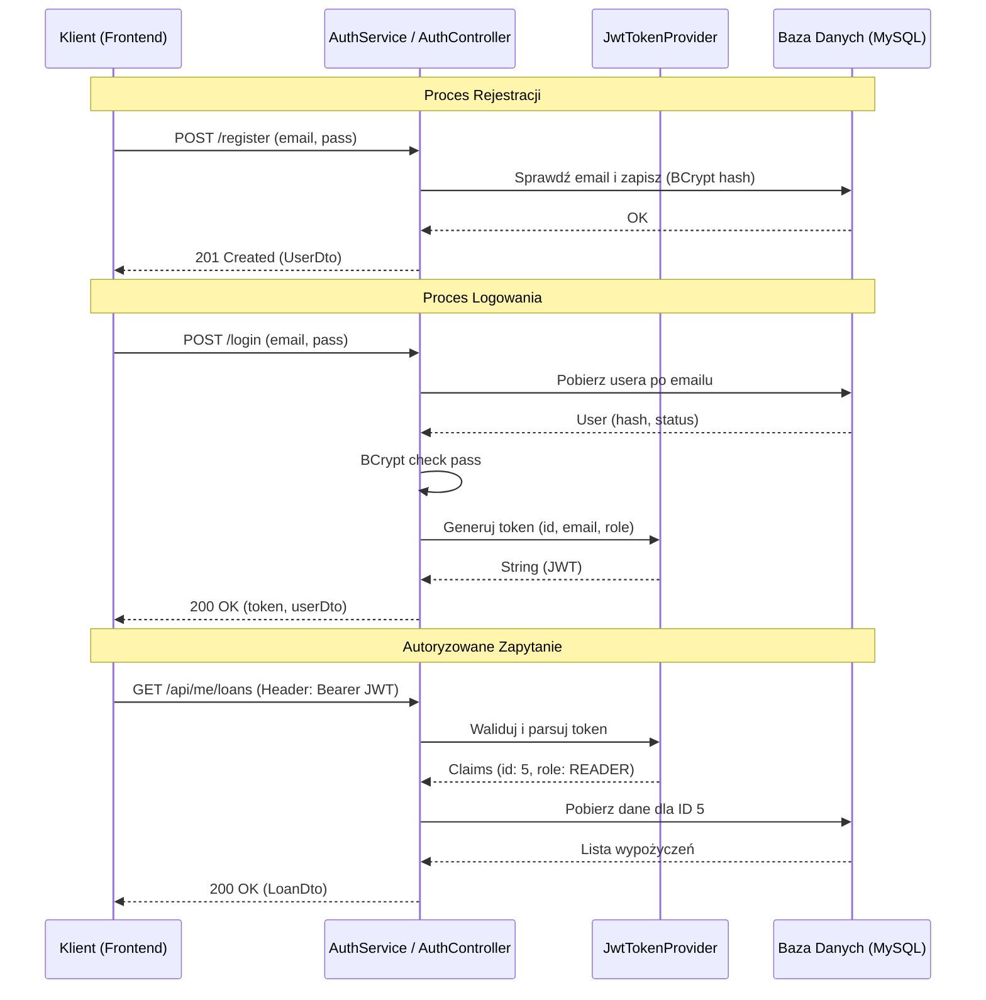

## 1. Opis projektu – założenia projektowe (biblioteka)

System to webowa aplikacja do obsługi biblioteki (książki + użytkownicy + wypożyczenia).
Backend: Java (Spring / JPA), frontend: React, baza: MySQL.

### Główne cele systemu

* Udostępnianie **katalogu książek** (tytuły, autorzy, kategorie, dostępność).
* Obsługa **wypożyczeń i zwrotów** książek.
* Obsługa **rezerwacji** (gdy książka jest aktualnie wypożyczona).
* Zarządzanie **użytkownikami** (kontami czytelników) przez administratora/bibliotekarza.
* Podgląd **historii wypożyczeń** i **prostych statystyk** (np. najczęściej wypożyczane tytuły w danym miesiącu).

---

## 2. Role aplikacyjne + ich funkcjonalności

### 2.1. Rola: **Czytelnik** (użytkownik zalogowany)

Profil: zwykły użytkownik, który chce znaleźć i wypożyczyć książkę.

**Funkcjonalności:**

* Rejestracja konta (opcjonalnie, możliwe też zakładanie konta przez admina).
* Logowanie do systemu.
* Przeglądanie katalogu książek:
  * filtrowanie / sortowanie (po tytule, autorze, kategorii, dacie wydania itp.),
  * podgląd szczegółów książki (opis, autor, liczba dostępnych egzemplarzy).
* Wypożyczenie książki (jeśli są wolne egzemplarze).
* Złożenie **rezerwacji** na książkę (jeśli aktualnie brak wolnych egzemplarzy).
* Przeglądanie swojej:
  * listy aktualnych wypożyczeń,
  * historii wypożyczeń,
  * ewentualnych kar/ograniczeń (np. przekroczony termin).
* Przedłużenie terminu wypożyczenia (jeśli regulamin i stan książki na to pozwala).
* Edycja własnego profilu (np. zmiana hasła, maila).
---
### 2.2. Rola: **Administrator / Bibliotekarz**

Profil: pracownik biblioteki zarządzający zasobami i użytkownikami.

**Funkcjonalności:**

* Logowanie do panelu administracyjnego.
* Zarządzanie katalogiem książek:
  * dodawanie nowych książek,
  * edycja danych książek (tytuł, autor, opis, kategoria, liczba egzemplarzy),
  * oznaczanie książek jako wycofane / usuwanie książek (np. jeśli brak egzemplarzy).
* Zarządzanie egzemplarzami:
  * dodawanie / usuwanie fizycznych egzemplarzy,
  * oznaczanie egzemplarza jako zniszczony/zaginiony.
* Obsługa wypożyczeń:
  * ręczne zarejestrowanie wypożyczenia (np. na podstawie numeru karty czytelnika),
  * rejestrowanie zwrotu,
  * podgląd listy aktualnych wypożyczeń.
* Zarządzanie użytkownikami:
  * przeglądanie listy użytkowników,
  * podgląd szczegółów (historia wypożyczeń, aktualne wypożyczenia),
  * blokowanie kont (np. za zaległości),
  * reset hasła (np. nadanie tymczasowego).
* Podgląd **statystyk**:
  * najczęściej wypożyczane książki w danym miesiącu/roku,
  * liczba wypożyczeń w danym okresie,
  * liczba aktywnych użytkowników.

---

## 3. Przypadki użycia – Czytelnik

(Diagramy sekwencji dla kluczowych procesów znajdują się w pliku `SequenceDiagrams.md`)

### 3.1. Lista podstawowych przypadków użycia (Czytelnik)

1. **Zarejestruj konto**
2. **Zaloguj się** (UC01 - patrz `SequenceDiagrams.md`)
3. **Przeglądaj katalog książek**
4. **Wyszukaj książkę**
5. **Wyświetl szczegóły książki**
6. **Wypożycz książkę** (UC03 - patrz `SequenceDiagrams.md`)
7. **Zarezerwuj książkę**
8. **Wyświetl aktualne wypożyczenia**
9. **Wyświetl historię wypożyczeń**
10. **Przedłuż wypożyczenie**
11. **Edytuj dane profilu**
12. **Zmień hasło**

### 3.2. Opisy przypadków użycia – Czytelnik

**UC1 – Zaloguj się**

* **Aktor:** Czytelnik
* **Cel:** Uzyskać dostęp do funkcji dostępnych tylko dla zalogowanych użytkowników (wypożyczanie, rezerwacje, podgląd historii).
* **Warunek wstępny:** Użytkownik ma założone konto.
* **Scenariusz główny:**

  1. Użytkownik otwiera stronę logowania.
  2. Wprowadza login (np. e-mail) i hasło.
  3. System weryfikuje dane (hasło zaszyfrowane w bazie).
  4. Jeśli dane są poprawne, system loguje użytkownika i przenosi do panelu użytkownika.
* **Warunek końcowy:** Użytkownik ma aktywną sesję w systemie.

---

**UC2 – Przeglądaj katalog książek**

* **Aktor:** Czytelnik
* **Cel:** Znaleźć interesujące książki w bibliotece.
* **Scenariusz główny:**

  1. Użytkownik otwiera moduł katalogu.
  2. System wyświetla listę książek (stronicowanie, podstawowe dane).
  3. Użytkownik może filtrować/sortować listę (np. po autorze, kategorii).
  4. Użytkownik może przejść do szczegółów konkretnej książki.

---

**UC3 – Wypożycz książkę**

* **Aktor:** Czytelnik
* **Cel:** Wypożyczyć wybraną książkę.
* **Warunek wstępny:** Użytkownik jest zalogowany, książka ma dostępny egzemplarz, użytkownik nie jest zablokowany.
* **Scenariusz główny:**

  1. Użytkownik wchodzi w szczegóły wybranej książki.
  2. System pokazuje liczbę dostępnych egzemplarzy.
  3. Użytkownik klika „Wypożycz”.
  4. System tworzy rekord wypożyczenia powiązany z użytkownikiem i egzemplarzem książki, ustala datę wypożyczenia i termin zwrotu.
  5. System aktualizuje liczbę dostępnych egzemplarzy.
* **Warunek końcowy:** Książka jest przypisana do użytkownika jako wypożyczona.

---

**UC4 – Zarezerwuj książkę**

* **Aktor:** Czytelnik
* **Cel:** Zarezerwować książkę, gdy wszystkie egzemplarze są wypożyczone.
* **Warunek wstępny:** Brak dostępnych egzemplarzy danej książki.
* **Scenariusz główny:**

  1. Użytkownik wchodzi w szczegóły książki, system pokazuje „brak dostępnych egzemplarzy”.
  2. Użytkownik klika „Zarezerwuj”.
  3. System dodaje użytkownika do kolejki rezerwacji dla tej książki.
* **Warunek końcowy:** Użytkownik jest na liście rezerwacji.

---

**UC5 – Wyświetl historię wypożyczeń**

* **Aktor:** Czytelnik
* **Cel:** Sprawdzić, jakie książki wypożyczał w przeszłości.
* **Scenariusz główny:**

  1. Użytkownik przechodzi do zakładki „Moja historia”.
  2. System wyświetla listę wcześniejszych wypożyczeń z datami wypożyczenia i zwrotu.

---

## 4. Przypadki użycia – Administrator/Bibliotekarz

(Diagramy sekwencji dla procesów administratora znajdują się w pliku `SequenceDiagrams.md`)

### 4.1. Lista podstawowych przypadków użycia (Administrator)

1. **Zaloguj się do panelu administratora**
2. **Dodaj nową książkę** (UC18 - patrz `SequenceDiagrams.md`)
3. **Edytuj dane książki**
4. **Usuń książkę / oznacz jako wycofaną**
5. **Dodaj egzemplarz książki**
6. **Usuń egzemplarz książki**
7. **Zarejestruj wypożyczenie** (np. gdy operacja wykonywana jest przy stanowisku bibliotekarza)
8. **Zarejestruj zwrot książki**
9. **Przeglądaj listę użytkowników**
10. **Wyświetl dane użytkownika** (w tym aktualne wypożyczenia i historia)
11. **Zablokuj / odblokuj użytkownika** (UC13 - patrz `SequenceDiagrams.md`)
12. **Przeglądaj statystyki wypożyczeń** (UC23 - patrz `SequenceDiagrams.md`)

### 4.2. Przykładowe opisy przypadków użycia – Administrator

**UC-A1 – Dodaj nową książkę**

* **Aktor:** Administrator
* **Cel:** Dodać nową pozycję do katalogu biblioteki.
* **Scenariusz główny:**

  1. Administrator przechodzi do modułu zarządzania książkami.
  2. Kliknięcie „Dodaj książkę”.
  3. Wprowadzenie danych: tytuł, autor, kategoria, opis, rok wydania, liczba egzemplarzy początkowych.
  4. System zapisuje książkę w bazie danych.
  5. System tworzy odpowiednią liczbę egzemplarzy powiązanych z książką.
* **Warunek końcowy:** Nowa książka jest widoczna w katalogu.

---

**UC-A2 – Usuń książkę**

* **Aktor:** Administrator
* **Cel:** Usunąć książkę z katalogu lub oznaczyć jako wycofaną.
* **Warunek wstępny:** Książka nie ma aktywnych wypożyczeń (albo system zablokuje usunięcie).
* **Scenariusz główny:**

  1. Administrator otwiera szczegóły książki.
  2. Kliknięcie „Usuń” / „Wycofaj”.
  3. System sprawdza, czy książka ma aktywne wypożyczenia.
  4. Jeśli nie ma – książka jest usuwana lub oznaczana jako wycofana (niewidoczna dla czytelników).
* **Warunek końcowy:** Książka nie jest dostępna dla czytelników.

---

**UC-A3 – Przeglądaj listę użytkowników i ich dane**

* **Aktor:** Administrator
* **Cel:** Sprawdzić dane czytelników oraz ich aktywność.
* **Scenariusz główny:**

  1. Administrator przechodzi do listy użytkowników.
  2. System wyświetla tabelę z użytkownikami (imię, nazwisko, e-mail, status).
  3. Administrator wybiera konkretnego użytkownika.
  4. System wyświetla szczegóły użytkownika, aktualne wypożyczenia, historię wypożyczeń, ewentualne blokady.
* **Warunek końcowy:** Administrator ma podgląd danych użytkownika i może np. podjąć decyzję o blokadzie.

---

**UC-A4 – Przeglądaj statystyki wypożyczeń**

* **Aktor:** Administrator
* **Cel:** Zobaczyć statystyki biblioteki w ujęciu czasowym.
* **Scenariusz główny:**

  1. Administrator przechodzi do modułu statystyk.
  2. Wybiera zakres dat (np. miesiąc, rok).
  3. System generuje i wyświetla wykresy (np. liczba wypożyczeń w danym miesiącu, top 10 książek).
* **Warunek końcowy:** Administrator widzi dane w formie tabeli + wykresów.

---

## 5. Proces Autentykacji i Autoryzacji

Dokument opisuje mechanizmy bezpieczeństwa zaimplementowane w systemie, w tym rejestrację użytkowników, proces logowania oraz generowanie i weryfikację tokenów JWT.

---

### 5.1. Rejestracja Użytkownika

Proces rejestracji pozwala nowym osobom na założenie konta w systemie z domyślną rolą `READER` (Czytelnik).

#### Przepływ (Flow):
1. **Żądanie:** Klient wysyła dane (`email`, `password`, `firstName`, `lastName`) na endpoint `POST /api/auth/register`.
2. **Walidacja:** System sprawdza, czy podany adres email jest już zajęty w bazie danych.
3. **Bezpieczeństwo Hasła:** Hasło w postaci jawnej **nigdy nie jest zapisywane**. System używa algorytmu `BCrypt` (klasa `PasswordEncoder`) do wygenerowania bezpiecznego hasha.
4. **Tworzenie Encji:** Tworzona jest nowa encja `AppUser` ze statusem `ACTIVE` i aktualną datą utworzenia.
5. **Odpowiedź:** System zwraca dane użytkownika (bez hasła) w formacie `UserDto` z kodem `201 Created`.

---

### 5.2. Logowanie i Generowanie JWT

Logowanie jest jedynym procesem, w którym użytkownik przesyła swoje hasło. Wynikiem poprawnego logowania jest token JWT (JSON Web Token).

#### Przepływ (Flow):
1. **Żądanie:** Klient wysyła `email` i `password` na endpoint `POST /api/auth/login`.
2. **Weryfikacja Poświadczeń:**
    - Pobranie użytkownika z bazy po adresie email.
    - Porównanie przesłanego hasła z hashem zapisanym w bazie (`passwordEncoder.matches`).
    - Sprawdzenie, czy konto nie jest zablokowane (`status == 'BLOCKED'`).
3. **Generowanie Tokena:**
    - Jeśli dane są poprawne, `JwtTokenProvider` tworzy token JWT.
    - **Algorytm:** HMAC SHA256 (`HS256`).
    - **Claimy (Zawartość):**
        - `sub` (Subject): ID użytkownika.
        - `email`: Adres email.
        - `role`: Rola użytkownika (`READER` lub `ADMIN`).
        - `iat` (Issued At): Czas wystawienia.
        - `exp` (Expiration): Czas wygaśnięcia (domyślnie 24h).
4. **Odpowiedź:** Klient otrzymuje obiekt `AuthResponse` zawierający token oraz uproszczone dane użytkownika.

---

### 5.3. Autoryzacja Żądań (JWT Flow)

Po zalogowaniu, klient musi dołączać token do każdego chronionego zapytania.

#### Przekazywanie Tokena:
Klient umieszcza token w nagłówku HTTP:
```http
Authorization: Bearer <twój_token_jwt>
```

#### Proces weryfikacji na Backendzie (`JwtAuthenticationFilter`):
1. **Przechwycenie:** Filtr wyciąga ciąg znaków po słowie `Bearer ` z nagłówka `Authorization`.
2. **Walidacja:**
    - Sprawdzenie podpisu cyfrowego tokena przy użyciu klucza tajnego (`jwtSecret`).
    - Sprawdzenie, czy token nie wygasł.
3. **Ekstrakcja Danych:** Pobranie `userId` oraz `role` z wnętrza tokena.
4. **Kontekst Bezpieczeństwa:** 
    - System mapuje rolę z bazy na format Spring Security (dodanie prefixu `ROLE_`, np. `ROLE_ADMIN`).
    - Ustawienie obiektu `Authentication` w `SecurityContextHolder`.
    - Od tego momentu kontrolery mogą korzystać z adnotacji `@PreAuthorize("hasRole('ADMIN')")` lub pobierać ID użytkownika przez `@CurrentUser`.

---

### 5.4. Parametry Techniczne

| Parametr | Wartość / Opis |
| :--- | :--- |
| **Algorytm Hashowania Hasła** | BCrypt (siła/cost: domyślna dla Spring Security) |
| **Algorytm Podpisu JWT** | HMAC SHA256 (HS256) |
| **Nagłówek Autoryzacji** | `Authorization` |
| **Prefix Tokena** | `Bearer ` |
| **Domyślny Czas Wygaśnięcia** | 86400 sekund (24 godziny) |
| **Klucz Tajny** | Definiowany przez właściwość `app.jwt.secret` |

---

### 5.5. Diagram Podsumowujący



---

